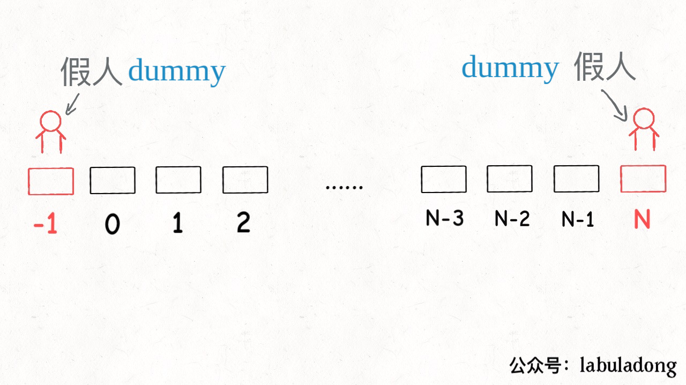
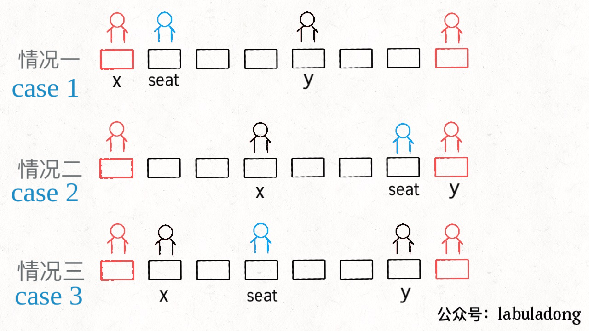

**Translator: [SCUhzs](https://github.com/HuangZiSheng001)**

**Author: [labuladong](https://github.com/labuladong)**


# How to arrange candidates' seats

This is the number 885 question in LeetCode, which is interesting and skillful. Solving such problems is not as intellectually demanding as algorithms like dynamic programming, but rather depends on your understanding of common data structures and your ability to write code. As far as I'm concerned, it deserves our attention and study.

In addition, I'd like to add a digression. Many readers ask me that how the algorithm framework is summed up. In fact, the framework is slowly extracted from the details. I hope that,  you'd better take some time to try the relevant problems by yourself after you read our article. As the poem said, "Paper will sleep shallow, never know the matter want to practice."

First of all, let me describe the topic: suppose there is an examination room, with a row of `N` seats, and the indexes are respectively '[0.. n-1]'.  Candidates will  **successively** enter the examination room and may leave at **any time**.

As an examiner, you should arrange the seats for the examinees to meet the following requirements:  **whenever a student enters, you need to maximize the distance between him and the nearest other persons; if there are multiple such seats, arrange him to the seat with the smallest index.** It's very realistic, right?

In other words, please implement the following class:

```java
class ExamRoom {
    // Construct a function, receive the N which means total number of seats  
    public ExamRoom(int N);
    // when a candidate comes, return to the seat that you assigned him
    public int seat();
    // The candidate in the position P now left
    // It can be considered that there must be a candidate in the position P
    public void leave(int p);
}
```

For example, there are five seats in the examination room, which are `[0..4]`:

When the candidate 1 enters  (call `seat()`), it is OK to sit in any position, but you need to arrange the lowest index position for him, that is, return position 0.

When the candidate 2 enters (call `seat()`), he should keep away from the person nearby as possible, that is, return to position 4.

When the candidate 3 enters, he should keep away from the person next to him as possible, so he need to sit in the middle, that is, seat 2.

If another candidate enters, he can sit in seat 1 or seat 3. Take the smaller index 1.

And so on.

In the situation just mentioned, the function `leave`  is not called, but the readers can definitely find the regular:

**If every two adjacent candidates are regarded as the two ends of the line segment, the new arrangement is to find the longest line segment,  then let the candidates  「dichotomy」 the line segment in the middle, and the middle point is the seat which assigned to him. `Leave (P) ` is actually to remove the end point `p`, so that two adjacent line segments are combined into one.**

The core idea is very simple, right? So this question actually examines your understanding of data structure. What data structure do you use to implement the above logic?

### 1. Thinking analysis

According to the above ideas, first of all, we need to abstract the students sitting in the classroom into line segments, which can be simply represented by an array of size 2.

In addition, the idea requires us to find the 「longest」 line segment,  and we also need to remove the line segment and add the line segment.

**If we meet the requirement of getting the most value in the dynamic process, we must use the ordered data structure.  Binary heap and balanced binary search tree is  what we use most often.** The time complexity to get the maximum value of the priority queue implemented with binary heap is O (logN), but only the maximum value can be deleted. The balanced binary tree can also take the maximum value, modify or delete any one value, and the time complexity is O (logN) too.

To sum up, binary heap can't satisfy the operation of `leave` , so balanced binary tree should be used. And here we will use a structure `TreeSet` which belongs to JAVA, which is an ordered data structure, and it's order at the bottom  is maintained by the red black tree.

By the way, when it comes to Set or Map, some readers may take it for granted that it is a HashSet or a HashMap, which is something wrong with that.

Because the bottom of hash Set/Map is implemented by the hash function and the array, it has the feature  that the traversal order is not fixed while the operation is efficient, and its time complexity is O (1).

Meanwhile, the Set/Map can also rely on other underlying data structures, The Red Black Tree (a balanced binary search tree) is the common one, which has a feature that maintaining the order of elements automatically and its efficiency is O (logn). This type is commonly referred to as 「ordered Set/Map」.

The `TreeSet` we use just is an ordered set. Its purpose is to maintain the order of line length, quickly find the longest line, and quickly delete and insert.

### 2. Simplify the problem

Firstly, if there are multiple optional seats, you need to choose the seat with the lowest index, right? **Let's simplify the problem first, Ignore this requirement for the moment** , and implement the above ideas.

Another common programming trick used in this problem is to use a 「virtual line segment」 to get the algorithm to start properly, which is a principle related to linked list algorithms that need a 「virtual header」.

```java
// Map endpoint p to the segment with P as the left endpoint
private Map<Integer, int[]> startMap;
// Map endpoint p to the segment with P as the right endpoint
private Map<Integer, int[]> endMap;
// Store all line segments from small to large according to their length
private TreeSet<int[]> pq;
private int N;

public ExamRoom(int N) {
    this.N = N;
    startMap = new HashMap<>();
    endMap = new HashMap<>();
    pq = new TreeSet<>((a, b) -> {
        // Calculate the length of two line segments
        int distA = distance(a);
        int distB = distance(b);
        // Longer means it is bigger, and put it back
        return distA - distB;
    });
    // Firstly, put a virtual segment in the ordered set
    addInterval(new int[] {-1, N});
}

/* Remove a line segment */
private void removeInterval(int[] intv) {
    pq.remove(intv);
    startMap.remove(intv[0]);
    endMap.remove(intv[1]);
}

/* Add a line segment */
private void addInterval(int[] intv) {
    pq.add(intv);
    startMap.put(intv[0], intv);
    endMap.put(intv[1], intv);
}

/* Calculate the length of a line segment */
private int distance(int[] intv) {
    return intv[1] - intv[0] - 1;
}
```

「Virtual line segment 」is to represent all seats as one line segment:




With the foreshadowing, the main API `seat` and `leave` could be written:


```java
public int seat() {
    // Take the longest line from the ordered set
    int[] longest = pq.last();
    int x = longest[0];
    int y = longest[1];
    int seat;
    if (x == -1) { // case 1
        seat = 0;
    } else if (y == N) { // case 2
        seat = N - 1;
    } else { // case 3
        seat = (y - x) / 2 + x;
    }
    // Divide the longest line segment into two segments
    int[] left = new int[] {x, seat};
    int[] right = new int[] {seat, y};
    removeInterval(longest);
    addInterval(left);
    addInterval(right);
    return seat;
}

public void leave(int p) {
    // Find out the lines around p
    int[] right = startMap.get(p);
    int[] left = endMap.get(p);
    // Merge two segments into one
    int[] merged = new int[] {left[0], right[1]};
    removeInterval(left);
    removeInterval(right);
    addInterval(merged);
}
```




At this point, the algorithm is basically implemented. Although there are many codes, the idea is very simple: find the longest line segment, divide it into two segments from the middle, and the midpoint is the return value of `seat()`; find the Find  left and right line segments of `p`   and merge them into one segment, which is the logic of `leave (P)`.


### 3. Advanced problem

However, when the topic requires multiple choices, choose the seat with the smallest index. We just ignored this problem. For example, the following situation may cause errors:

Now there are lines `[0,4]` and  `[4,9]` in the ordered set. Then the longest line segment `longest` is the latter one. According to the logic of `seat`, it will split the `[4,9]`, that is, return to seat 6. But the correct answer should be seat 2, because both 2 and 6 meet the condition of maximizing the distance between adjacent candidates, and the smaller one should be taken.


**The solution to this type of  requirement is to modify the sorting method of ordered data structure.** Specific to the problem, is that,  modify the logic of `treemap`'s comparison function:

```java
pq = new TreeSet<>((a, b) -> {
    int distA = distance(a);
    int distB = distance(b);
    // If the lengths are equal, compare the indexes
    if (distA == distB)
        return b[0] - a[0];
    return distA - distB;
});
```

Beside that, we also need to change the `distance` function. Instead of simply letting it calculate the length between two endpoints of a line segment, we need to let it calculate the length between the midpoint and endpoint of the line segment.

```java
private int distance(int[] intv) {
    int x = intv[0];
    int y = intv[1];
    if (x == -1) return y;
    if (y == N) return N - 1 - x;
    // Length between midpoint and endpoint
    return (y - x) / 2;
}
```


In this way, the `distance` values of `[0,4]` and `[4,9]` are equal. The algorithm will compare the indexes of the two and take smaller line segments for segmentation. So far, this algorithm problem has been solved perfectly.

### 4. Final summary

​	The problem I'm talking about in this article is not so hard, although it seems that there is a lot of code. The core issue is to review the understanding and use of ordered data structure to sort it out.

​	To deal with dynamic problems, we usually use ordered data structures, such as balanced binary search tree and binary heap, which have similar time complexity, but the former supports more operations.

​	Since balanced binary search tree is so easy to use, why use binary heap? The reason is that, the bottom layer of binary heap is array, which is easy to implement. See the old article 「detailed explanation of binary heap」 to learn more detail.  Try to make a Red Black Tree, you? The operation is complex and consumes more space. To solve the specific problems, we should choose the appropriate data structure.

​	I hope this article can be helpful for you.


坚持原创高质量文章，致力于把算法问题讲清楚，欢迎关注我的公众号 labuladong 获取最新文章：

